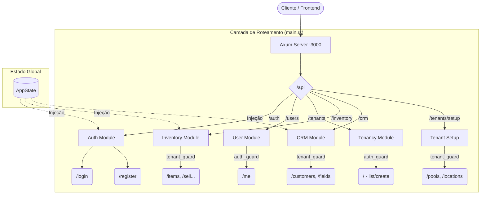

# Visão Geral da Aplicação (Entry Point)

A aplicação utiliza o framework **Axum** e segue uma arquitetura modular. A `main.rs` atua como o orquestrador, inicializando o `AppState` (conexão com banco) e compondo as rotas.

## Mapa de Rotas e Módulos

O diagrama abaixo ilustra como as rotas são agrupadas e quais middlewares protegem cada grupo.

