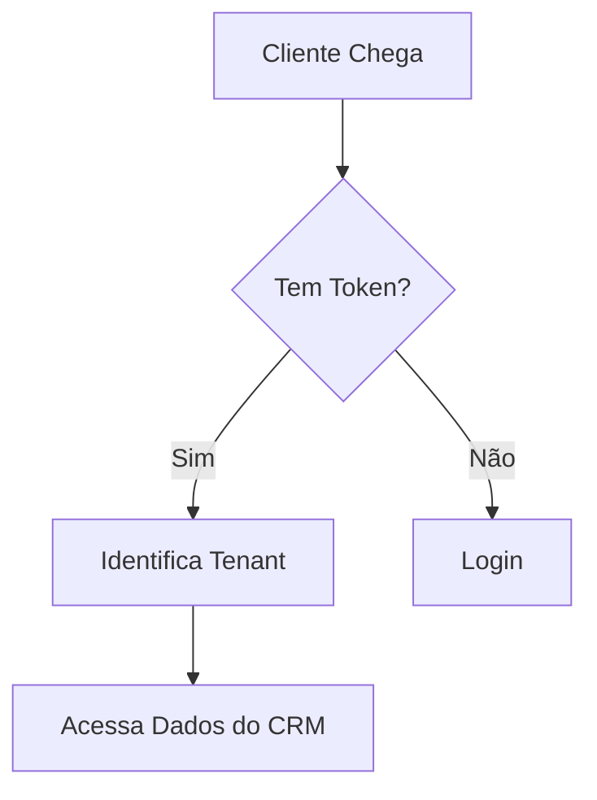

# Teste de Arquitetura

Aqui está um exemplo do fluxo de tenants:

```mermaid
graph TD;
    A[Cliente Chega] --> B{Tem Token?};
    B -- Sim --> C[Identifica Tenant];
    B -- Não --> D[Login];
    C --> E[Acessa Dados do CRM];
```